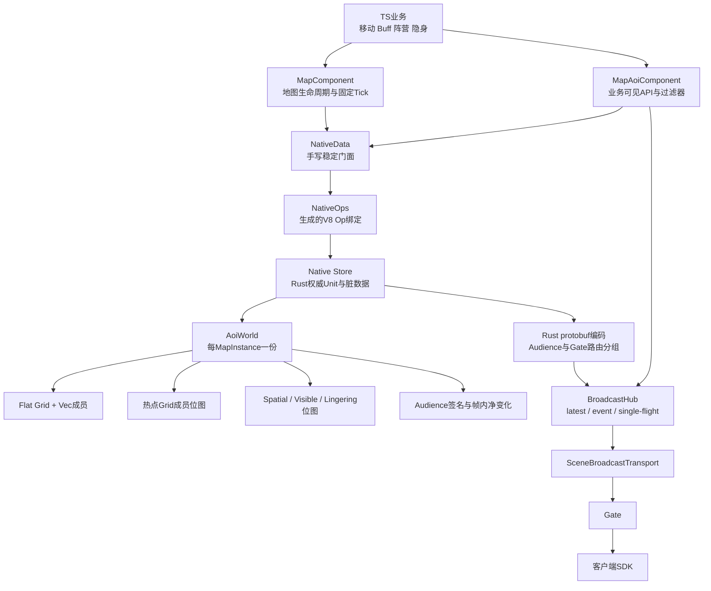
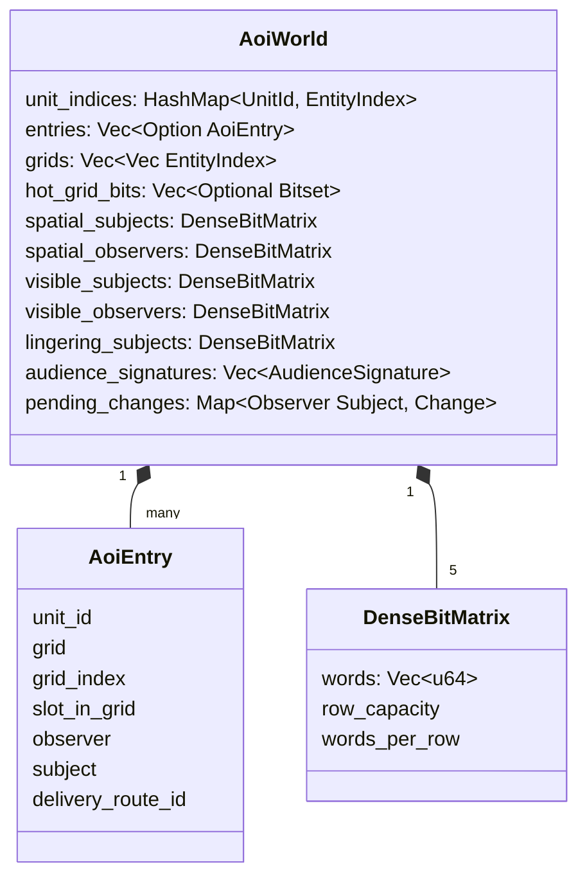
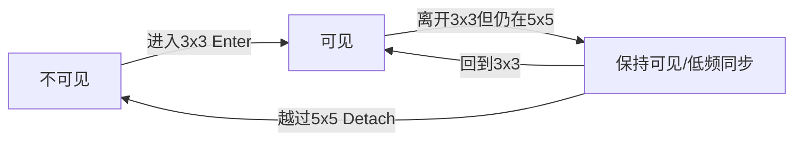
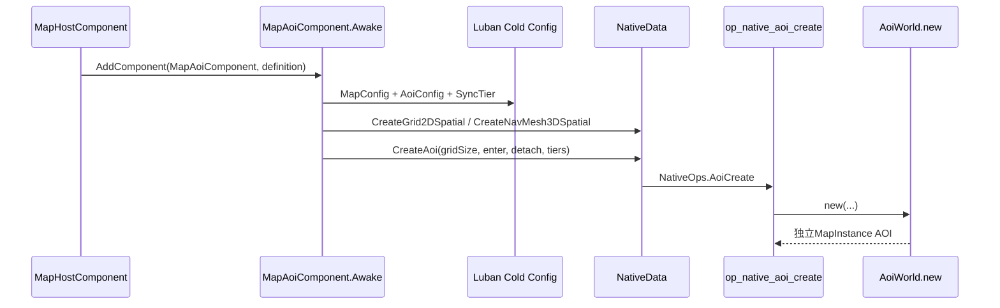
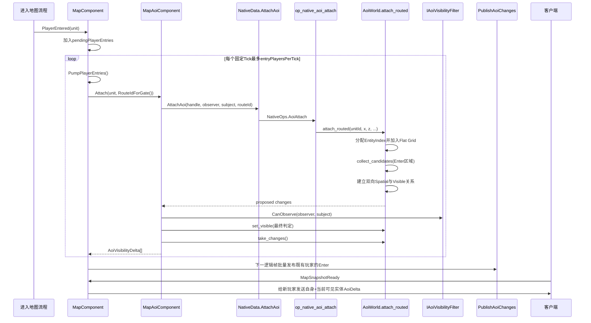
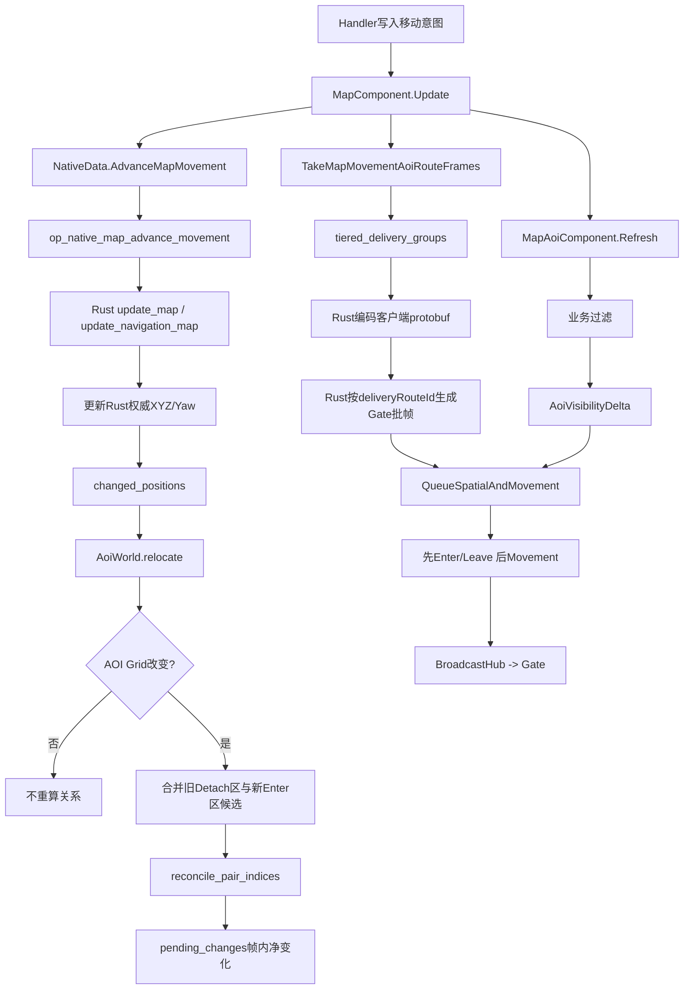
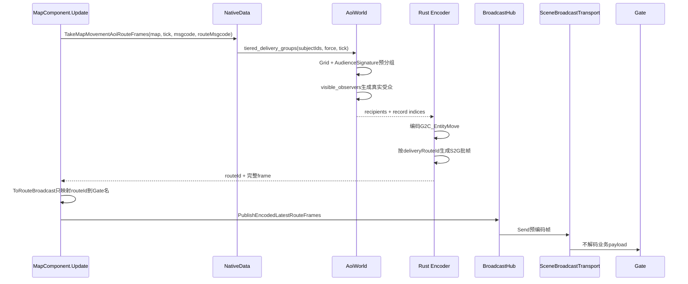
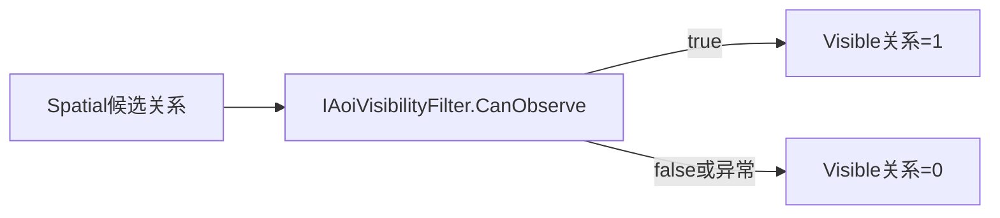
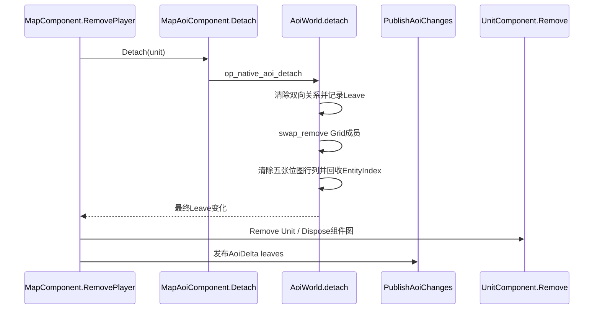

# TiangZ AOI完整设计与调用关系

本文描述TiangZ当前AOI的真实实现，不是未来设想。阅读目标是回答四个问题：AOI为什么这样设计、权威数据在哪里、一次业务操作经过哪些函数、业务开发者应该调用什么。

空间坐标、Cell/Grid尺寸、NavMesh3D约束见[地图空间与3D坐标契约](spatial-world.md)。本文只聚焦“谁能看见谁”和“状态如何发给这些人”。

## 一句话模型

> 每个MapInstance在Rust中拥有一个独立`AoiWorld`：扁平Grid负责找候选，双向位图保存最终可见关系，TS只负责业务过滤、生命周期编排和调用广播框架；Movement由Rust直接编码并按Gate扇出。

## 设计意图

AOI不是一个“广播所有附近玩家”的工具函数，而是地图内持续存在的权威关系系统。它必须同时满足：

1. **关系正确**：Enter、迟滞、Leave、业务过滤和断线/传送的顺序不能错。
2. **移动便宜**：玩家在同一个AOI Grid内移动时，不重新计算邻居。
3. **广播可复用**：Movement、Numeric、外观、Buff等业务共享同一份最终受众，不各建一套空间索引。
4. **TS低负担**：业务代码不保存观察者列表，不操作`EntityIndex`，不手工按Gate分组。
5. **Rust不绕回TS**：高频Movement的受众计算、protobuf编码和Gate分桶全部留在Rust。
6. **事件与状态分开**：Enter/Leave不可丢；位置等可覆盖状态只保留最新值。

## 术语

| 名称 | 含义 |
|---|---|
| Cell | 地图最小空间单位。Grid2D可按Cell离散移动，NavMesh3D可在Cell内连续移动。 |
| AOI Grid | AOI空间索引单位，由多个Cell组成；只有跨Grid才重算空间关系。 |
| Observer | 观察别人、需要接收下行消息的实体。玩家通常是Observer。 |
| Subject | 可以被别人观察和广播的实体。玩家、怪物、NPC通常是Subject。 |
| Spatial关系 | 只根据Enter/Detach范围计算出的候选可见关系。 |
| Visible关系 | Spatial关系经过阵营、隐身、位面等业务过滤后的最终关系。 |
| Lingering关系 | 已经Enter，但位于Enter外、Detach内的迟滞关系。 |
| EntityIndex | Rust Scene内可复用的紧凑下标；不是UnitId，也不能暴露给业务。 |
| deliveryRouteId | Map内为Gate分配的紧凑路由号，供Rust直接按Gate生成下行帧。 |
| Audience | 一条业务消息最终要发送给哪些Unit。AOI只是Audience的一种来源。 |

## 总体分层



### 各层职责

| 层 | 负责 | 不负责 |
|---|---|---|
| 业务TS | 修改权威状态、声明过滤规则、选择业务Audience | 建空间索引、缓存附近玩家、按Gate组包 |
| `MapAoiComponent` | Attach/Detach、业务过滤、Invalidate、AOI Audience查询 | 每Tick移动推进、protobuf编码 |
| `MapComponent` | 入图排队、固定Tick、Enter/Leave发布、状态复制编排 | 维护空间关系算法 |
| `NativeData/NativeOps` | TS到Rust的稳定边界、参数与二进制外壳 | 保存TS镜像数据 |
| `AoiWorld` | Grid索引、迟滞、最终关系、同步档位、Audience分组 | 阵营/隐身等具体业务含义 |
| `BroadcastHub` | 事件投递、latest合并、single-flight、背压统计 | 判断谁在AOI内 |
| Gate | Unit到connection路由、网络下行 | 重算AOI、解码并重编码业务payload |

## Rust数据结构



### 为什么同时需要UnitId和EntityIndex

- UnitId是协议、业务和跨进程使用的稳定标识。
- EntityIndex是单个`AoiWorld`内部的紧凑数组下标。
- `UnitId -> EntityIndex`哈希只在API入口定位一次。
- 候选扫描、位图关系和Audience签名都使用EntityIndex，不逐候选回查HashMap。
- EntityIndex复用前会清除五张关系矩阵的对应行列，不能继承旧实体关系。

### Grid成员

有限地图把Grid直接铺成一维数组：

```text
gridIndex = gridZ * gridWidth + gridX
```

每个Grid默认保存连续`Vec<EntityIndex>`。实体记录`slotInGrid`，跨Grid时：

```text
旧Grid swap_remove(slotInGrid)
修复被交换实体的 slotInGrid
新Grid push(EntityIndex)
```

因此成员迁移为O(1)。单Grid达到128个实体时，Rust额外创建成员位图；降到96以下释放。普通稀疏Grid不承担位图内存，热点Grid通过位或合并重叠的旧Detach区和新Enter区。该阈值是框架实测结果，不是业务配置。

### 五张关系矩阵

```text
spatial_subjects[observer][subject]  空间候选正向
spatial_observers[subject][observer] 空间候选反向
visible_subjects[observer][subject]  最终可见正向
visible_observers[subject][observer] 最终可见反向
lingering_subjects[observer][subject] 迟滞关系
```

双向矩阵不是重复业务数据，而是用内存换取两个方向的快速查询：

- “我能看见谁”读取`visible_subjects`。
- “谁能看见我”读取`visible_observers`。
- Buff公开外观通常需要后者。
- 阵营变化后按影响方向读取Spatial关系重新过滤。

## 可见范围和迟滞

默认配置是3×3 Enter和5×5 Detach：



核心判定在`AoiWorld.reconcile_pair_indices()`：

```text
afterSpatial = distance <= enterRadius
            || beforeSpatial && distance <= detachRadius
```

这意味着：

- 从未Enter的实体不会因为处于迟滞圈而突然可见。
- 已经可见的实体不会在边界反复Enter/Leave。
- 迟滞只保持关系，不绕过业务过滤。

## 地图创建调用链



意图：空间模式、Grid尺寸、Enter/Detach和同步频率都是Cold Model。运行中的地图不能替换这些参数，也不能让TS临时维护另一份配置。

## 玩家进入调用链



### 为什么入图要排队

一次Attach不只是插入数组，还可能建立大量关系、准备Snapshot并产生下行。`PlayerEntered()`先进入地图级队列，`PumpPlayerEntries()`每Tick只放行冷配置规定的人数，避免批量登录在一个Tick形成Attach洪峰。

### 为什么新玩家快照晚一点发

EnterMap RPC保持小响应。客户端先创建地图并注册`AoiDelta`监听，再发送`MapSnapshotReady`；Map随后向本人发送“自己 + 当前可见实体”的完整快照，避免客户端尚未安装Handler时丢失大包。

## 移动与固定Tick调用链



`AdvanceMapMovement()`会直接对本Tick实际改变的位置调用`AoiWorld.relocate()`。`MapAoiComponent.Refresh()`还处理其他FastOP直接写坐标产生的空间脏数据，并统一运行TS业务过滤器。

### 跨Grid重算做什么

`AoiWorld.relocate()`执行：

1. 合并旧位置Detach范围与新位置Enter范围。
2. 普通Grid扫描连续数组，热点Grid用位图OR。
3. `scratch_candidate_seen`去重。
4. 对“移动实体作为Observer”和“移动实体作为Subject”两个方向分别判定。
5. 通过`reconcile_pair_indices()`应用Enter/迟滞/Leave。
6. 更新Spatial、Visible、Lingering矩阵与Audience签名。
7. 把同一帧反复变化折叠进`pending_changes`。

玩家只在Grid内移动时，第1到第7步全部跳过。

## Movement同步与Gate直达

Movement是高频、可覆盖状态，走专用Rust路径：



关键点：

- TS不会收到每个Subject的完整recipient数组。
- 相同最终受众的Subject共享一次客户端frame编码。
- Audience签名只用于快速预分组，最终仍读取真实Visible位图，不以Hash碰撞决定权限。
- 开始、停止和转向的`stateChanged`强制立即发送。
- 普通持续移动按同步档位节流，例如3×3内20Hz、5×5迟滞圈5Hz。
- `QueueSpatialAndMovement()`保证同一关系先收到Enter，再收到Movement。
- 在途时新的Movement覆盖旧Movement，不形成无限Promise链。

## Numeric与UnitState调用链

Numeric和Unit固定字段同样使用AOI受众，但不走Movement的专用Gate直达入口：

```mermaid
flowchart LR
  Dirty[Rust字段置脏] --> Flush[MapComponent.FrameFlush]
  Flush --> Replication[StateReplicationSystem]
  Replication --> Peek[PeekMapNumericAoiDelta / PeekMapUnitAoiDelta]
  Peek --> Audience[AoiWorld.delivery_groups]
  Audience --> Encoded[NativeAoiBatch: recipients + frame]
  Encoded --> MapRoute[TS将UnitId映射为Gate路由]
  MapRoute --> Hub[BroadcastHub latest single-flight]
  Hub --> Ack[成功后Ack revision]
```



原因是Numeric/UnitState需要revision、Ack和dirty保留语义。发送失败不能清除脏数据；下一帧继续修改时只保留最新revision。

## Enter/Leave调用链

Enter/Leave是生命周期事件，不能用latest覆盖：

```text
AoiWorld.set_visible_relation_indices()
  -> record_change()
  -> 同帧相反变化折叠为最终净结果
  -> MapAoiComponent.CommitChanges()
  -> MapComponent.PublishAoiChanges()
  -> 按Subject聚合Observer
  -> 为Enter构造一次Snapshot
  -> 按相同Observer集合合并多个Subject
  -> ClientBroadcasts.AoiDelta
```

`G2C_AoiDelta`内：

- `enters`携带实体完整公开Snapshot。
- `leaves`只携带需要移除的UnitId。
- 客户端先处理Enter建立实体，再处理后续状态。
- 同一逻辑帧内“Enter后Leave”可以折叠为无变化，但已经跨帧发布的生命周期事件不能撤回。

## 业务可见性过滤

阵营、隐身、位面属于业务规则，不写死在Rust AOI中：



过滤器必须：

- 同步返回`boolean`。
- 只读取内存Component。
- 不使用Promise、RPC、数据库或消息发送。
- 不修改Entity。
- 异常时按不可见处理。

业务状态变化后显式调用：

| 变化 | API |
|---|---|
| 只影响“我能看见谁” | `aoi.InvalidateObserver(unit)` |
| 只影响“谁能看见我” | `aoi.InvalidateSubject(unit)` |
| 两个方向都影响 | `aoi.Invalidate(unit)` |

过滤只会收窄已有Spatial候选关系，不能让Detach范围外的实体强制可见。

## 业务广播API

### 在Handler或System中取得入口

业务代码只需要从Unit所属MapScene取得`MapComponent`：

```ts
import { MapComponent } from "../../../model/demo/map/MapComponent";

const map = unit.DomainScene().GetComponent(MapComponent);

// map.Audience：创建AOI逻辑受众。
// map.Broadcast：发送业务广播，内部负责UnitId -> Gate -> connection。
```

Demo中的参考位置：

- [`MapComponent.Broadcast/Audience`](../../app/model/demo/map/MapComponent.ts)：业务广播和AOI受众的公开入口。
- [`MapAoiComponent.ObserversOf/VisibleSubjectsOf`](../../app/model/demo/map/MapAoiComponent.ts)：两个明确方向的Audience工厂。
- [`C2M_UseItemHandler`](../../app/hotfix/demo/mapHost/handlers/C2M_UseItemHandler.ts)：Handler只把协议值交给ItemComponent。
- [`ItemComponent.UseItemTransactional`](../../app/hotfix/demo/item/ItemComponentSystem.ts)：事务确认后发布只通知自己的立即道具事件。
- [`MapComponent.PublishItemChanged`](../../app/model/demo/map/MapComponent.ts)：现有“只通知自己、不可覆盖”的完整Demo。

业务不要从Handler直接导入`NativeData`或`NativeOps`。这些入口属于Map框架层，不是“更快的业务API”。

### 广播Subject的公开表现

例如“玩家获得真言术：盾，附近玩家要看到护盾外观”：

```ts
import { ClientBroadcasts } from "../../../generated/model/server/demo/protocol/broadcastDescriptors";
import type { BuffPublicView } from "../../../generated/model/server/demo/protocol/messages";
import { MapComponent } from "../../../model/demo/map/MapComponent";
import type { PlayerUnit } from "../../../model/demo/map/PlayerUnit";

export async function PublishBuffAdded(
  player: PlayerUnit,
  buff: BuffPublicView,
): Promise<void> {
  const map = player.DomainScene().GetComponent(MapComponent);
  const nearby = map.Audience.ObserversOf(player, true);

  // BuffAdded是不可覆盖事件：创建一次就必须让当前受众收到一次。
  await map.Broadcast.Publish(
    nearby,
    ClientBroadcasts.BuffAdded,
    { buff },
  );
}
```

`ObserversOf(subject)`表示“当前谁能看见这个Subject”。这是Buff外观、施法动作、头顶称号等最常用方向。未来Buff数据实体建议放在`app/model/demo/buff/`，生命周期System放在`app/hotfix/demo/buff/`；Handler只调用`unit.GetComponent(BuffComponent).Add(...)`，不要在Handler里拼AOI受众。

### Buff移除

```ts
export async function PublishBuffRemoved(
  player: PlayerUnit,
  buffInstanceId: bigint,
  revision: number,
): Promise<void> {
  const map = player.DomainScene().GetComponent(MapComponent);
  await map.Broadcast.Publish(
    map.Audience.ObserversOf(player, true),
    ClientBroadcasts.BuffRemoved,
    { unitId: player.UnitId, buffInstanceId, revision },
  );
}
```

移除和添加一样是不可覆盖事件。Buff的周期Tick只执行Action；除非Buff公开字段真的变化，否则Tick本身不广播Buff。

### 向Observer当前视野内的对象发送业务信息

```ts
const audience = map.Audience.VisibleSubjectsOf(player, false);
```

这个方向较少用于客户端广播，更常用于服务端逻辑查询。不要把它和`ObserversOf`写反：

```text
ObserversOf(A)        = 谁正在看A
VisibleSubjectsOf(A) = A正在看谁
```

### 私密详情与AOI公开数据分开

AOI只决定空间受众。队友Buff吸收值等详情应组合业务Audience：

```text
公开Buff外观 -> ObserversOf(subject)
详细Buff数值 -> Self + PartyAudience
```

不要通过把无权限字段写成0来伪装裁剪，也不要修改AOI关系来表达组队权限。

```ts
import { ClientAudience } from "../../../core/public";

const map = player.DomainScene().GetComponent(MapComponent);
const party = ClientAudience.ForUnits(`party:${partyId}`, partyMemberUnitIds);
const detailAudience = ClientAudience.Union(
  ClientAudience.Self(player.UnitId),
  party,
);

await map.Broadcast.Publish(
  detailAudience,
  ClientBroadcasts.BuffDetail,
  {
    unitId: player.UnitId,
    buffInstanceId,
    absorbRemaining,
    revision,
  },
);
```

`BuffDetail`是latest状态，key为`unitId + buffInstanceId`；下行拥堵期间只保留同一Buff的最新详情。示例中的`partyMemberUnitIds`应由未来PartyComponent提供，AOI不负责查询组队成员。

### 阵营、隐身或位面过滤器

过滤器只做同步内存判断：

```ts
import type { Unit } from "../../../core/public";
import type { IAoiVisibilityFilter } from "../../../model/demo/map/MapAoiComponent";

export class PhaseVisibilityFilter implements IAoiVisibilityFilter {
  CanObserve(observer: Unit<any[]>, subject: Unit<any[]>): boolean {
    const observerPhase = observer.GetComponent(PhaseComponent).PhaseId;
    const subjectPhase = subject.GetComponent(PhaseComponent).PhaseId;
    return observerPhase === subjectPhase;
  }
}
```

地图初始化时注册一次：

```ts
map.Audience.AddFilter(new PhaseVisibilityFilter());
```

位面状态改变后，业务显式失效关系并发布由此产生的Enter/Leave：

```ts
phaseComponent.PhaseId = nextPhaseId;
const changes = map.Audience.Invalidate(unit);
await map.PublishVisibilityChanges(changes);
```

只影响“别人能否看见我”的隐身状态使用`InvalidateSubject(unit)`；只影响“我能看见谁”的侦测状态使用`InvalidateObserver(unit)`。

### 道具变化：不使用AOI的现有Demo

[`C2M_UseItemHandler`](../../app/hotfix/demo/mapHost/handlers/C2M_UseItemHandler.ts)当前链路是：

```text
C2M_UseItemHandler.Handle
  -> unit.GetComponent(ItemComponent).UseItemTransactional(itemId, operationId)
  -> DBProxy确认且Inventory确实前进
  -> MapComponent.PublishItemChanged(unit, item)
  -> ClientAudience.Self(unit.UnitId)
  -> ClientBroadcasts.ItemChanged（event，不可覆盖）
```

对应代码：

```ts
return unit.GetComponent(ItemComponent).UseItemTransactional(
  request.itemId,
  request.operationId,
);
```

这个Demo刻意说明：不是所有地图消息都要经过AOI。背包是玩家私有数据，直接使用`Self`比先查AOI再排除其他人更清晰。

### 移动：业务不要手工广播

[`C2M_MoveHandler`](../../app/hotfix/demo/mapHost/handlers/C2M_MoveHandler.ts)只提交移动意图。后续权威推进、跨Grid判断、受众分组和Movement广播都由`MapComponent.Update()`与Rust完成。Handler中禁止调用`ObserversOf()`后再手工发送`EntityMove`，否则会产生两套位置广播。

### 创建和销毁Unit：业务不要直接Attach/Detach

玩家进入由[`MapComponent.PlayerEntered/PumpPlayerEntries`](../../app/model/demo/map/MapComponent.ts)统一排队Attach；玩家离开由`RemovePlayer()`先Detach再Dispose。普通业务创建怪物时也应该通过地图Unit工厂和统一生命周期入口，而不是直接调用：

```ts
// 错误示例：业务层不得调用Native AOI op。
NativeData.AttachAoi(...);
NativeData.DetachAoi(...);
```

框架层直接调用`MapAoiComponent.Attach/Detach`时，必须继续遵守“完整组件图后Attach、Native Entity销毁前Detach”的顺序。

## 玩家离开与地图销毁



顺序必须是“先Detach，后销毁Native Unit”。Rust会拒绝释放仍包含Attach实体的`AoiWorld`。地图Scene销毁时，`MapAoiComponent.OnDestroy()`依次释放AOI与空间实例。

## 三种广播语义

| 类型 | 示例 | AOI如何参与 | 是否可覆盖 |
|---|---|---|---|
| 生命周期事件 | Enter、Leave、BuffAdded、BuffRemoved、技能命中 | 取得最终Audience，按事件发送 | 不可覆盖 |
| 高频可覆盖状态 | Movement、Navigate | Rust按Visible关系和同步档位分组，直接按Gate编码 | 可覆盖，只保留最新 |
| 脏字段状态 | Numeric、UnitState | 帧尾按Visible关系分组，revision成功后Ack | 同帧可合并，失败不能丢脏 |

业务开发前应先判断语义，再选择广播入口。AOI不是“所有消息都帧尾合并”的理由。

## 关键不变量

1. 一个MapInstance只有一个Rust `AoiWorld`。
2. Unit完整组件图提交后才能Attach。
3. Native Unit销毁前必须Detach。
4. UnitId不等于EntityIndex。
5. Visible关系永远是Spatial关系的子集。
6. 自己的权威状态单独加入Audience，不创建自己观察自己的关系边。
7. Gate归属在Attach期间稳定；换Gate必须重新Attach。
8. Enter/Leave先于同一关系的状态消息。
9. 业务过滤器不异步、不产生副作用。
10. TS不保存全量可见关系镜像。
11. AOI配置是Cold Model，不能运行时热更。
12. 超过16384个AOI实体会明确拒绝Attach，不静默扩张内存。

## 性能意图

| 机制 | 解决的问题 |
|---|---|
| Flat Grid | 有限地图坐标直接算数组下标，避免坐标Hash。 |
| `Vec + slotInGrid` | O(1)跨Grid迁移，缓存连续。 |
| 热点Grid位图 | 高密度候选集合用OR合并，减少重复扫描。 |
| 双向Visible位图 | 同时快速回答“我看谁”和“谁看我”。 |
| EntityIndex连续存储 | 候选循环不逐实体查询UnitId HashMap。 |
| AudienceSignature | 相同受众Subject先归组，避免重复构造大Audience。 |
| Rust route frame | Movement不把recipient数组拉回TS，不重复编码。 |
| single-flight/latest | 下行较慢时保留最新状态，不堆无限Promise。 |
| 入图队列 | 把Attach与Snapshot洪峰摊到多个Tick。 |

当前不采用每Tick CSR全量重建，因为正式负载中大部分实体不跨Grid；不动的实体不应承担重建成本。十万级单Scene也不能直接扩大当前完整稠密矩阵，应改为空间分片或分块稀疏位图。

## 可观测指标

排查AOI时优先查看：

| 指标/报告字段 | 含义 |
|---|---|
| `aoiCandidateRelations` | Spatial候选有向关系数。 |
| `aoiVisibleRelations` | 业务过滤后的最终有向关系数。 |
| `aoiRelocationsPerSecond` | 每秒真正跨AOI Grid的实体数。 |
| `aoiVisibilityChangesPerSecond` | Enter/Leave最终净变化速率。 |
| `tiangz_aoi_lingering_relations` | 当前迟滞关系数量。 |
| `tiangz_aoi_rejected_relations` | 被业务过滤器拒绝的Spatial关系数量。 |
| Map `aoiRefreshMs` | TS过滤与变化提交阶段耗时。 |
| Map `movementEncodeMs` | Rust受众分组、编码和Gate分桶耗时。 |
| Broadcast pending/coalesced | 下行是否跟不上固定Tick。 |
| overload/timeout/backpressure/slow | 是否已经丢工作；非零样本不能作为容量结论。 |

## 代码导航

| 位置 | 作用 |
|---|---|
| `src/aoi.rs` | `AoiWorld`、Flat Grid、热点位图、关系矩阵、迟滞和Audience分组。 |
| `src/native_data.rs` | AOI Native Op、权威移动推进、脏位置刷新、protobuf与Gate路由编码。 |
| `src/generated/native_ops.rs` | 生成的Rust Op注册表，业务不手改。 |
| `app/model/demo/native/NativeData.ts` | TS到Rust的稳定门面和二进制结果解析。 |
| `app/generated/model/native/NativeOps.ts` | 生成的TS Native Op绑定，业务不手改。 |
| `app/model/demo/map/MapAoiComponent.ts` | Attach/Detach、过滤器、Invalidate和业务Audience入口。 |
| `app/model/demo/map/MapComponent.ts` | 入图队列、固定Tick、Movement与AoiDelta发布顺序。 |
| `app/core/broadcast/BroadcastHub.ts` | latest、event、single-flight和背压控制。 |
| `app/model/demo/broadcast/SceneBroadcastTransport.ts` | Map到Gate的内部批量传输。 |
| `proto/OuterMessage_C_10001.proto` | `G2C_AoiDelta`、Movement、Numeric等客户端协议。 |
| `game_config/Datas/` | Map、AOI范围和同步档位Cold配置。 |

## 修改AOI前的检查顺序

1. 先判断修改的是空间候选、业务过滤、同步频率还是广播语义。
2. 空间算法改`src/aoi.rs`，不要在TS创建第二份关系表。
3. 高频编码改`src/native_data.rs`，不要让Rust把大量逐实体数据绕回TS。
4. 业务权限实现`IAoiVisibilityFilter`或组合`ClientAudience`，不要污染空间算法。
5. 生命周期变化必须验证Attach、跨Grid、Invalidate、Detach和EntityIndex复用。
6. 性能测试必须同时检查吞吐、延迟、CPU和全部丢工作计数。
7. 设计变化同步更新本文、`project-context.md`与`business-development-manual.md`。
